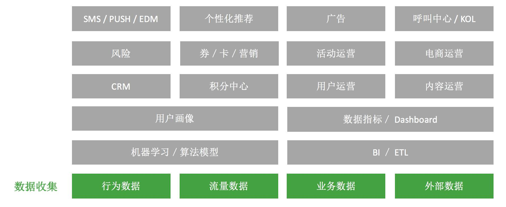

2017-02
===

[全球HTTPS时代已来，你跟上了吗？](https://jaq.alibaba.com/community/art/show?articleid=621)
---
2017-02-15, https

HTTPS在HTTP的基础上加入了[SSL/TLS](http://www.ruanyifeng.com/blog/2014/02/ssl_tls.html)协议，依靠SSL证书验证服务器身份，并为客户端和服务器之间建立“SSL加密通道”，确保传输处于加密状态等。

HTTP
* 数据在网络中裸奔
* 网页篡改和劫持无处不在
* 智能设备普及，WIFI接入常态化
* 自由的网络无法验证网站身份

HTTPS
* 苹果iOS强制开启ATS(App Transport Security)标准
* HTTP/2协议只支持HTTPS
* HTTPS提升搜索排名
* 英美强制要求所有政府网站使用HTTPS
* 超级权限应用禁止使用HTTP连接

重要的是培养研发的**安全意识**，业务刚需更快催动技术的升级改革

[为什么Google用Apache Beam彻底替换掉MapReduce](http://www.infoq.com/cn/articles/why-google-replace-beam-with-apache-mapreduce)
---

2017-02-15, MapReduce, Apache Beam

[Apache Beam](https://beam.apache.org/)原名Google DataFlow，一种用于批处理和流式处理的单一编程模型。

特点
* 统一的
* 可移植
* 可扩展

Beam关键部分
* Beam SDK
* Beam Pipeline Runner

主要关注点
* 数据
  * 有限数据集（HDSF文件&Hbase表）
  * 无限数据集（kafka等）
* 时间
* 乱序

WWWW
* What are you computing
* Where in event time
* When in processing time
* How do refinements relate

Beam 特别适用于并行数据处理，同时也可用于ETL。官网给出了[Example](https://beam.apache.org/get-started/quickstart-java/)，有兴趣可以尝试尝试。
[在谷歌公司里已经没人再使用MapReduce了](https://drive.google.com/file/d/0B6j6Te0viCnHOHYwWmpJNU1yZVU/view)，目前国内很多企业还处于MR的编程模型中，也有很多公司采用Spark实时计算，和Hive管理离线计算，希望以后能看到Beam模型能在更多的分布式数据处理平台得到支持。

[从零开始，构建数据化运营体系](http://www.itongji.cn/cms/article/articledetails?articleid=4917)
---
2017-02-16, 运营, 数据

数据化运营 —— 在运营基础上提出以数据决策

数据化运营体系四层架构
* 数据收集层
* 数据产品层
* 数据运营层
* 用户触达层

给自己的一个规划
---

可以考虑技术和业务视野两个方向拓展

技术上

* 集群运维
* 实时计算
* Java内存模型
* 大数据计算框架
* Linux运维知识
* 前端js&html拓展

业务方向

* 运营分析
* 大数据产品

作为一个从事大数据行业的程序员，更多的可能侧重在技术能力的提升，从而往往会忽略业务知识能力。数据驱动决策，需求驱动技术。多了解与大数据相关的业务知识，如运营、分析、挖掘、BI、数据产品等方向，可以更好地打磨技术。

[Java libraries you can't miss in 2017](http://blog.jevsejev.io/2017/02/19/java-libraries-you-cannot-miss-in-2017/)
---

* [Guice](https://github.com/google/guice)  
lightweight dependency injection framework for Java6 and above.

* [OkHttp](https://github.com/square/okhttp)  
An HTTP/HTTP2 client for Android and Java applications.

* [Retrofit](https://github.com/square/retrofit)  
Type-safe HTTP client for Andrioid and Java by Square.

* [JDeferred](https://github.com/jdeferred/jdeferred)  
Java Deferred/Promise library similar to JQuery.  

* [RxJava](https://github.com/ReactiveX/RxJava)   
Reactive Extensions for the JVM - A library for composing asynchronous and event-based programs using observable sequences for the JVM.

[腾讯内训讲稿：员工如何自我修炼？](https://mp.weixin.qq.com/s?__biz=MjM5MjMzMDg3Nw==&mid=2653454362&idx=1&sn=dcb03a0eb6325cbb4df2e9980e0afa6b&chksm=bd7bc5088a0c4c1e2df574b6ab9651884abd193690b3f89f74e77ea6931232d02804cb028c3c&mpshare=1&scene=1&srcid=0223bIgH1raXEYpSHqrWkVuw&key=ffe67a077c969a8bb7200b056dce145d574a31927942d3f6e81cd9607daa119d71c3b657e6d56324b2cfba4e695c2027f894fae8d9da7b6eca2646d96dc173b64e055617b049bfee15c6d54077366074&ascene=0&uin=MjUwOTIxODc4MA%3D%3D&devicetype=iMac+MacBookPro11%2C1+OSX+OSX+10.12+build(16A323))  
---

* 好好把话说清楚 - 表达清晰  
  * 按照事件节点，逐层展开叙述
  * 补充必要的条件
  * 重点决策点可以前置叙述  
* 保持学习 - 心中有一盘棋
  * 站在一定的高度
  * 多方面收集信息，理解信息和总结信息
  * 积极探索和讨论
* 项目思维 - 缜密的思维和推进
  * 项目化管理时间
  * 项目化管理你的工作内容、项目
  * 结构化思维
* 树立标签 - 尽可能让别人记得住你
  * 清晰自我的优势和定位
  * 写出自己要树立的标签，不要超过5个
  * 通过行为来塑造和固化你的标签
* 构建人脉 - 获取更多有价值的信息
  * 让自己成为信息中心
  * 发展自己的爱好
  * 敢于组织和愿意付出
* 敢于承担 - 敢于付出，不怕吃亏
  * 主动承担边际模糊工作
  * 敢于破局
  * 菜粉心 - 拿着白菜的钱，操着卖白粉的心

三个层次：`心态`、`社交`、`技能`，养成良好的工作习惯

[JAVA高并发解决方案](http://blog.csdn.net/zxl333/article/details/8454319)
---
2017-02-25, JAVA, 高并发

* HTML静态化
* 图片服务器分离
* 数据库集群和库表散列
* 缓存
* 镜像
* 负载均衡
