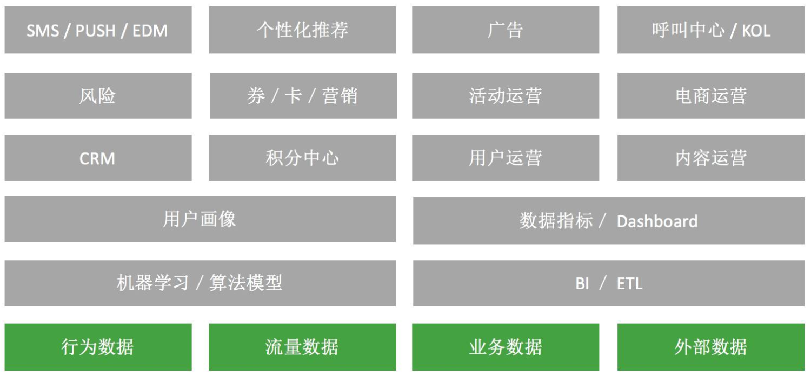

2017-02
===

[全球HTTPS时代已来，你跟上了吗？](https://jaq.alibaba.com/community/art/show?articleid=621)
---
2017-02-15, https

HTTPS在HTTP的基础上加入了[SSL/TLS](http://www.ruanyifeng.com/blog/2014/02/ssl_tls.html)协议，依靠SSL证书验证服务器身份，并为客户端和服务器之间建立“SSL加密通道”，确保传输处于加密状态等。

HTTP
* 数据在网络中裸奔
* 网页篡改和劫持无处不在
* 智能设备普及，WIFI接入常态化
* 自由的网络无法验证网站身份

HTTPS
* 苹果iOS强制开启ATS(App Transport Security)标准
* HTTP/2协议只支持HTTPS
* HTTPS提升搜索排名
* 英美强制要求所有政府网站使用HTTPS
* 超级权限应用禁止使用HTTP连接

重要的是培养研发的**安全意识**，业务刚需更快催动技术的升级改革

[为什么Google用Apache Beam彻底替换掉MapReduce](http://www.infoq.com/cn/articles/why-google-replace-beam-with-apache-mapreduce)
---

2017-02-15, MapReduce, Apache Beam

[Apache Beam](https://beam.apache.org/)原名Google DataFlow，一种用于批处理和流式处理的单一编程模型。

特点
* 统一的
* 可移植
* 可扩展

Beam关键部分
* Beam SDK
* Beam Pipeline Runner

主要关注点
* 数据
  * 有限数据集（HDSF文件&Hbase表）
  * 无限数据集（kafka等）
* 时间
* 乱序

WWWW
* What are you computing
* Where in event time
* When in processing time
* How do refinements relate

Beam 特别适用于并行数据处理，同时也可用于ETL。官网给出了[Example](https://beam.apache.org/get-started/quickstart-java/)，有兴趣可以尝试尝试。
[在谷歌公司里已经没人再使用MapReduce了](https://drive.google.com/file/d/0B6j6Te0viCnHOHYwWmpJNU1yZVU/view)，目前国内很多企业还处于MR的编程模型中，也有很多公司采用Spark实时计算，和Hive管理离线计算，希望以后能看到Beam模型能在更多的分布式数据处理平台得到支持。

[从零开始，构建数据化运营体系](http://www.itongji.cn/cms/article/articledetails?articleid=4917)
---
2017-02-16, 运营, 数据

数据化运营 —— 在运营基础上提出以数据决策

数据化运营体系四层架构
* 数据收集层
* 数据产品层
* 数据运营层
* 用户触达层

给自己的一个规划
---

可以考虑技术和业务视野两个方向拓展

技术上

* 集群运维
* 实时计算
* Java内存模型
* 大数据计算框架
* Linux运维知识
* 前端js&html拓展

业务方向

* 运营分析
* 大数据产品

作为一个从事大数据行业的程序员，更多的可能侧重在技术能力的提升，从而往往会忽略业务知识能力。数据驱动决策，需求驱动技术。多了解与大数据相关的业务知识，如运营、分析、挖掘、BI、数据产品等方向，可以更好地打磨技术。

[Java libraries you can't miss in 2017](http://blog.jevsejev.io/2017/02/19/java-libraries-you-cannot-miss-in-2017/)
---

* [Guice](https://github.com/google/guice)  
lightweight dependency injection framework for Java6 and above.

* [OkHttp](https://github.com/square/okhttp)  
An HTTP/HTTP2 client for Android and Java applications.
