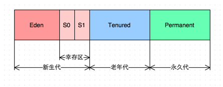
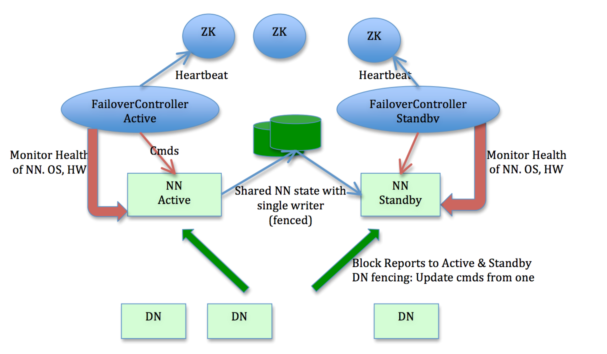
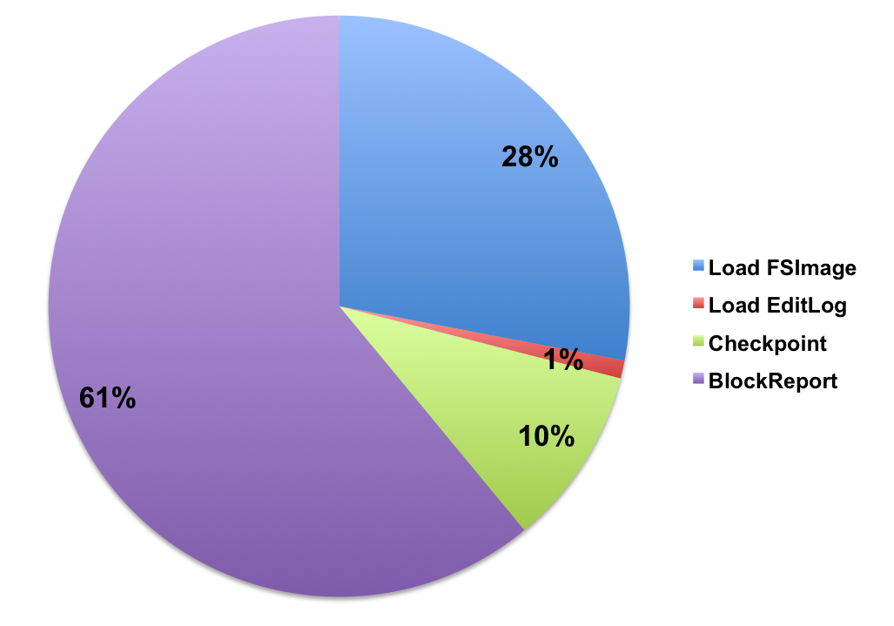
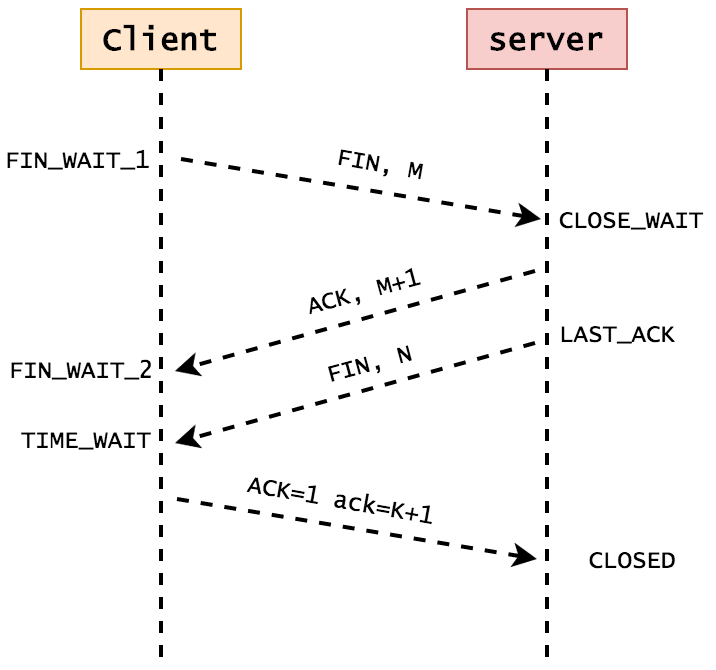
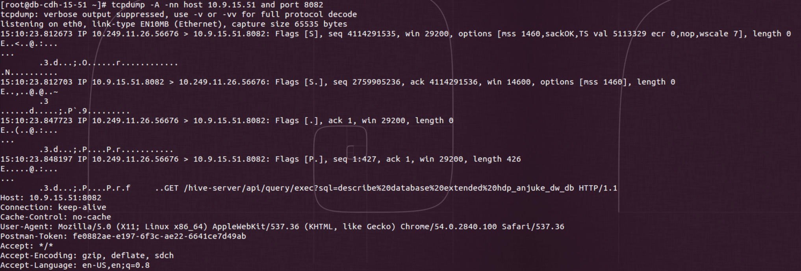
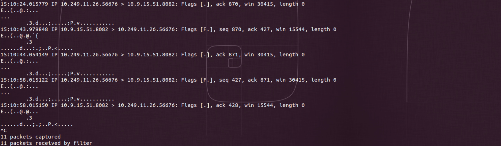

2017-03
===


[JVM为什么需要GC](http://www.infoq.com/cn/articles/why-jvm-need-gc)
--- 
2017-03-06, JVM, G1

GC发展简史

* JDK1.3.1 Serial GC - 串行方式
* JDK1.4.2 Parallel GC & Concurrent Mark Sweep (CMS) 
* JDK1.7   Garbage First GC

G1 - Garbage First 侧重点在于处理垃圾最多的地方，即垃圾优先


G1 GC的基本思想

* 并行性
* 并发性
* 分代GC
* 空间整理
* 可预见性


G1 GC垃圾回收机制

* 年轻代循环
* 多步骤并行标记循环
* 混合收集循环
* Full GC

G1 的区间设计灵感

在G1中，堆被分成若干个大小相等的区域（Region）。每个Region都有一个关联的Remembered Set ( 简称RS )，RS的数据结构是Hash表里面的数据是Card Table.   



简单来说，RS里储存的是Region中存活对象的指针。当Region中的数据发生变化时，首先反映到Card Table 中的一个或多个Card上，RS通过扫描内部Card Table 得知Region中内存使用情况和存活对象。在使用Region过程中，如果Region被填满，分配内存的线程会重新选择一个新的Region，空闲的Region被组织到一个基于链表（LinkedList）的数据结构里，这样可以快速找到Region。  


[HDFS NameNode 重启优化](http://www.infoq.com/cn/articles/namenode-restart-optimization)
--- 
2017-03-07, hdfs, namenode

基于[Hadoop-2.x](https://github.com/apache/hadoop/tree/branch-2) 和 [HA with QJM](http://hadoop.apache.org/docs/r2.7.1/hadoop-project-dist/hadoop-hdfs/HDFSHighAvailabilityWithQJM.html) 社区架构和系统设计：  


在HA with QJM架构下，NameNode的整个启动过程中始终以SBN（Standby NameNode）角色完成。

* NameNode 重启流程  
  * 加载FSImage
  * 回放EditLog
  * 执行Checkpoint
  * 收集所有DataNode的注册和数据块汇报

NameNode重启各阶段耗时占比：    



[TCP的三次握手与四次分手](http://www.jellythink.com/archives/705)
--- 
2017-03-08, tcp

* 网络的七层协议：`物理层`、`数据链路层`、`网络层`、`传输层`、`会话层`、`表示层`、`应用层`
* TCP/IP 位于`传输层`和`网络层`
* 了解TCP协议包的结构
  * Source Port & Destination Port
  * Sequence Number
  * Acknowledgment Number ( ack = seq + 1)
  * Offset
  * TCP Flags
  * Windows


TCP协议的三次握手示意图：   


说明：     
```  
a. 第一次握手：建立连接。客户端发送连接请求报文段，将SYN位置为1，Sequence Number为x；然后，客户端进入SYN_SEND状态，等待服务器的确认。  
b. 第二次握手：服务器收到SYN报文段。服务器收到客户端的SYN报文段，需要对这个SYN报文段进行确认，设置Acknowledgment Number为x+1(Sequence Number+1)；同时，自己自己还要发送SYN请求信息，将SYN位置为1，Sequence Number为y；服务器端将上述所有信息放到一个报文段（即SYN+ACK报文段）中，一并发送给客户端，此时服务器进入SYN_RECV状态。  
c. 第三次握手：客户端收到服务器的SYN+ACK报文段。然后将Acknowledgment Number设置为y+1，向服务器发送ACK报文段，这个报文段发送完毕以后，客户端和服务器端都进入ESTABLISHED状态，完成TCP三次握手。   
```


TCP协议四次分手示意图：    


说明：   
```   
a. 第一次分手：主机1（可以使客户端，也可以是服务器端），设置Sequence Number和Acknowledgment Number，向主机2发送一个FIN报文段；此时，主机1进入FIN_WAIT_1状态；这表示主机1没有数据要发送给主机2了。     
b. 第二次分手：主机2收到了主机1发送的FIN报文段，向主机1回一个ACK报文段，Acknowledgment Number为Sequence Number加1；主机1进入FIN_WAIT_2状态；主机2告诉主机1，我“同意”你的关闭请求。     
c. 第三次分手：主机2向主机1发送FIN报文段，请求关闭连接，同时主机2进入LAST_ACK状态。      
d. 第四次分手：主机1收到主机2发送的FIN报文段，向主机2发送ACK报文段，然后主机1进入TIME_WAIT状态；主机2收到主机1的ACK报文段以后，就关闭连接；此时，主机1等待2MSL后依然没有收到回复，则证明Server端已正常关闭，那好，主机1也可以关闭连接了。    
```

抓包观察：  
  


