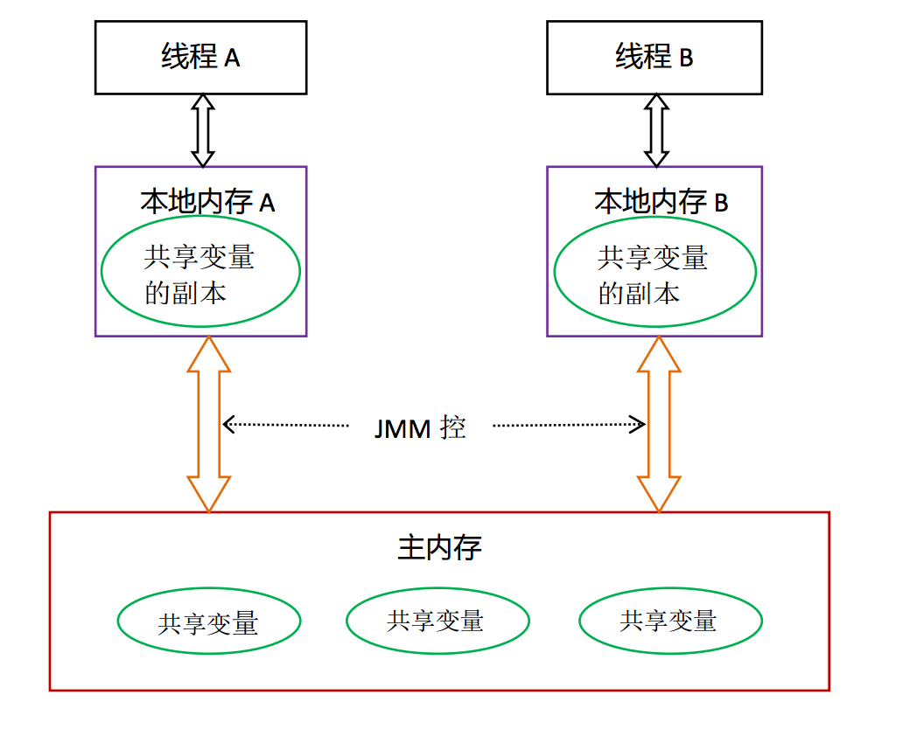
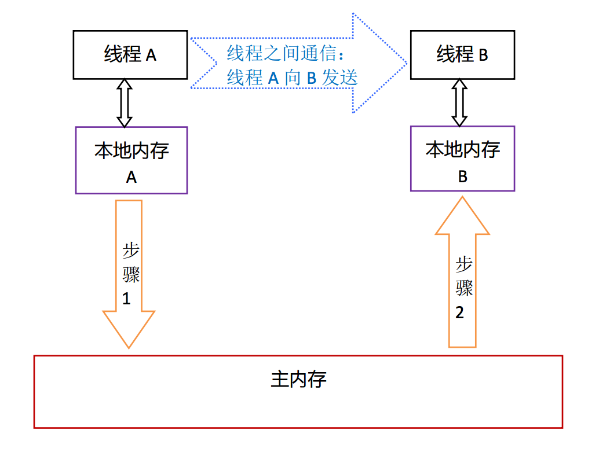
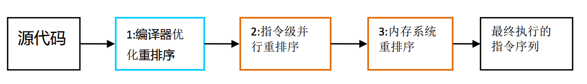

Contents
===  

* [Java Interviews](https://dongchuan.gitbooks.io/java-interview-question/content/)
* <a href="#深入理解java内存模型">深入理解Java内存模型</a>

深入理解Java内存模型
===

基础
---

* 并发编程模型的分类  
  * 共享内存 (Java)
  * 消息传递
* Java内存模型的抽象  
JMM - Java 内存模型 
Java中，所有实例域、静态域、数组元素都是存储在堆内存中，堆内存在线程之间共享。 
Java内存模型抽象示意图：

 线程A和线程B的通讯步骤： 

* 重排序
  * 编译器优化的重排序
  * 指令级并行的重排序
  * 内存系统的重排序

* 处理器重排序与内存屏障指令
* Happens-before
