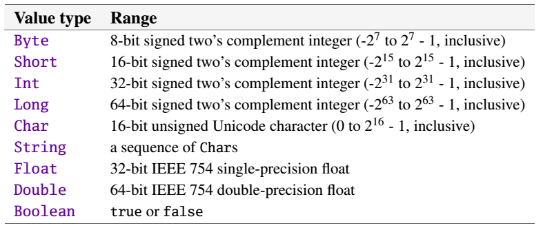
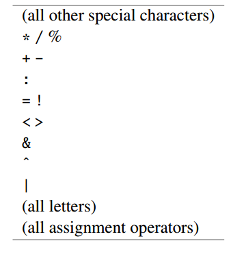

Scala入门到精通
===

[第一节 Scala语言初步](https://yq.aliyun.com/articles/60363)
---

scala是Martin Odersk于2001年开发，可用于大规模应用程序开发，也可用于脚本编程。

特点
* 简洁
* 优雅
* 类型安全

运行环境
* JVM
* .Net

[第二节 基本类型及操作、程序控制结构](https://yq.aliyun.com/articles/60392)
---

* 基本类型  
  
数据类型与JAVA一一对应，特点 **首字母大写**  

* 运算符优先级  



* 程序控制结构  
  * if
  * while
  * where
  * do while
  * for（to/until 区别）


[第三节 Array、List](https://yq.aliyun.com/articles/60391)
---

* 数组Array操作
  * 定长数组(Array)
  * 变长数组(ArrayBuffer)
  * 数组遍历
  * 数组转换
  * 多维数组

* 列表List操作
  * 类型定义
  * List一旦创建，不可改变
  * List伴生对象
  * List常用操作(`isEmpty`、`head`、`tail`、`last`、`reverse`、`drop`、`take`、`mkString`)

[第四节 Set、Map、Tuple、队列操作实战](https://yq.aliyun.com/articles/60390)  
---

scala中所有集合都来自scala.collection包及其子包`mutable`(可变集合)、`immutable`(不可变集合)当中，scala默认使用`immutable`集合，如要使用`mutable`需要在程序中引入
```  
import scala.collection.mutable
val mutableSet = mutable.Set(1, 2, 3)
```

scala.collection包中集合类层次结构：

  

scala.collection.immutable类层次结构：  
  

scala.collection.mutable类层次结构：
  

可变集合与不可变集合对应关系：   
  

[第五节 函数与闭包](https://yq.aliyun.com/articles/60389)  
---
#### 主要内容
* 函数字面量（值函数）
* 匿名函数
* 函数的简化
* 函数参数
* 闭包


#### 函数字面量

指函数可以赋值给变量，函数形式如下  
  

#### 匿名函数

```scala
println(Array(1,2,3,4).map((x:Int)=>x+1).mkString(","))
//简化
println(Array(1,2,3,4).map(_+1).mkString(","))
```

#### 函数参数

```scala
//函数参数(高阶函数）
//((Int)=>String)=>String
scala> def convertIntToString(f:(Int)=>String)=f(4)
convertIntToString: (f: Int => String)String
```

#### 函数闭包

闭包(Closure）

(x:Int)=>x+more,这里面的more是一个自由变量（Free Variable）, more是一个没有给定含义的不定变量  
而x则的类型确定、值在函数调用的时候被赋值，称这种变量为绑定变量（Bound Variable）


[第六节 类和对象（一）](https://yq.aliyun.com/articles/60388)
--- 

* 主要内容
  * 类定义、创建对象
  * 主构造器
  * 辅助构造器

[第七节 类和对象（二）](https://yq.aliyun.com/articles/60387)
--- 

* 主要内容
  * 单例对象
  * 伴生对象与伴生类
  * apply方法
  * 应用程序对象
  * 抽象类


伴生对象与伴生类：   

```scala  
class Student(var name:String,age:Int)

object Student {
  private var studentNo:Int=0;
  def uniqueStudentNo()={
    studentNo+=1
    studentNo
  }
  def main(args: Array[String]): Unit = {
    println(Student.uniqueStudentNo())
  }
}
```

apply方法： 
```scala  
val sets = List(1,2,3) 等同于下
val sets = List.apply(1,2,3)
```


[第八节 包和引入](https://yq.aliyun.com/articles/60386)
--- 

* 主要内容
  * 包的作用与定义
  * 包的作用域与引入的使用方法
  * 访问控制
  * 包对象
  * import高级特性
  * 内部类


[第九节 继承与组合](https://yq.aliyun.com/articles/60385)
--- 

* 主要内容
  * 类的继承
  * 构造函数执行顺序
  * 方法重写
  * 匿名类
  * 多态与动态绑定
  * 组合与继承的使用

多态举例：   
```scala  
//抽象Person类
abstract class Person(var name:String,var age:Int){

  def walk():Unit
  //talkTo方法，参数为Person类型
  def talkTo(p:Person):Unit
}

class Student(name:String,age:Int) extends Person(name,age){
  private var studentNo:Int=0
  def walk()=println("walk like a elegant swan")
  //重写父类的talkTo方法
  def talkTo(p:Person)={
    println("talkTo() method in Student")
    println(this.name+" is talking to "+p.name)
  }
}

class Teacher(name:String,age:Int) extends Person(name,age){
  private var teacherNo:Int=0

  def walk()=println("walk like a elegant swan")

   //重写父类的talkTo方法
  def talkTo(p:Person)={
    println("talkTo() method in Teacher")
    println(this.name+" is talking to "+p.name)
  }
}

object demo{
  def main(args: Array[String]): Unit = {

     //下面的两行代码演示了多态的使用
     //Person类的引用可以指向Person类的任何子类
     val p1:Person=new Teacher("albert",38)
     val p2:Person=new Student("john",38)

     //下面的两行代码演示了动态绑定
     //talkTo方法参数类型为Person类型
     //p1.talkTo(p2)传入的实际类型是Student
     //p2.talkTo(p1)传入的实际类型是Teacher
     //程序会根据实际类型调用对应的不同子类中的talkTo()方法
     p1.talkTo(p2)
     p2.talkTo(p1)
  }
}
```

[第十节 Scala类层次结构、Traits初步](https://yq.aliyun.com/articles/60384)
--- 

* 主要内容
  * scala类层次结构总览
  * scala中原生类型的实现方式解析
  * Nothing、Null类型解析
  * Traits简介
  * Traits几种不同使用方式


